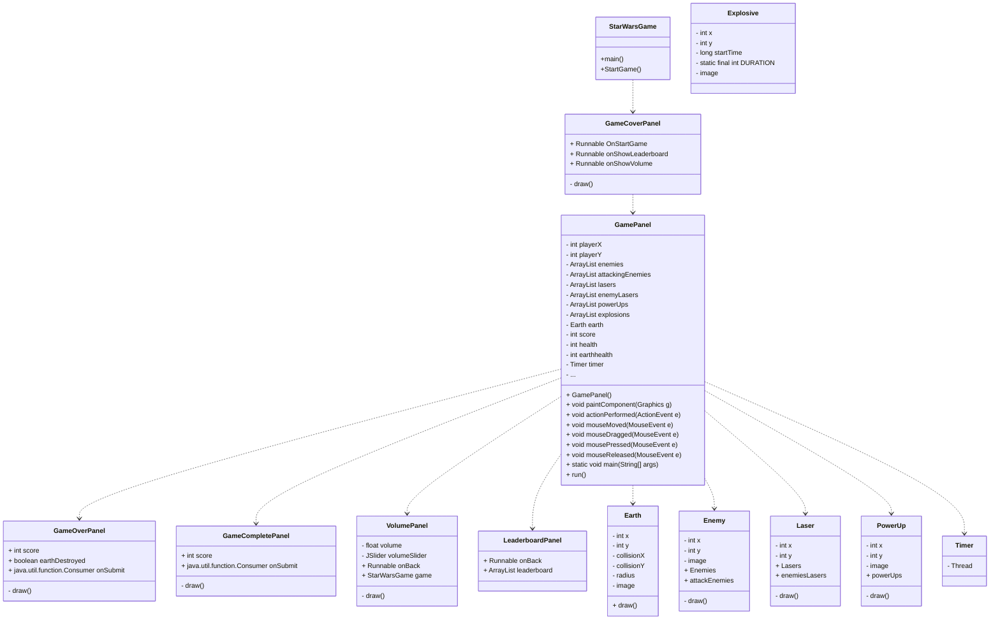
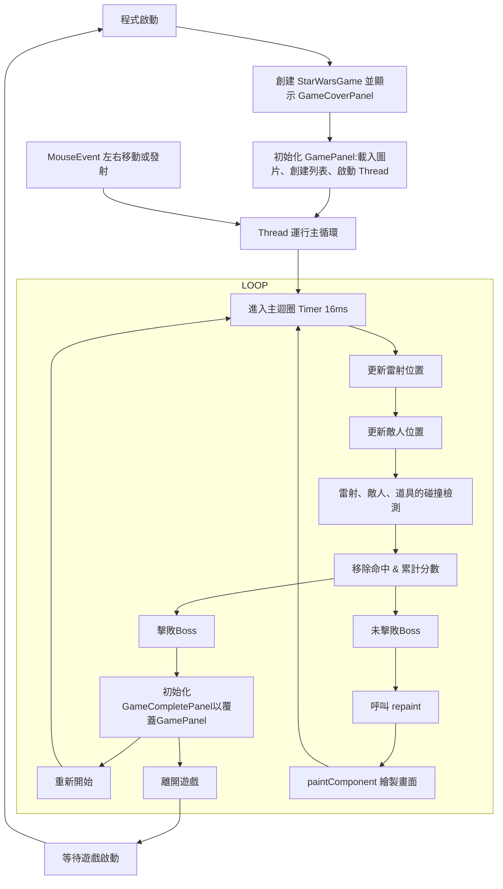
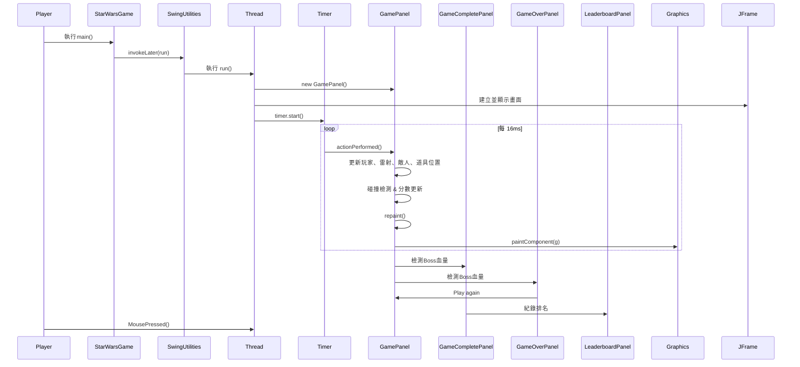

# 2025 JAVA 期末專案範例
- 學號：B11207011 姓名：謝育翰、- 學號：B11207142 姓名：許育銘
- 分工說明：
- 謝育翰:Space Invader 基礎功能列表:2、4、5、6、7、9、10
- 許育銘:Space Invader 基礎功能列表:1、3、8、11、12
- [報告影片連結]([https://www.youtube.com/watch?v=PtsLcZIT9bI](https://www.youtube.com/watch?v=PtsLcZIT9bI&feature=youtu.be))


## 遊戲說明
-目標: 玩家控制飛船擊敗敵人累積分數，保護地球並最終擊敗 BOSS 通關，當玩家生命值或地球生命值降至 0，或擊敗 BOSS 時遊戲結束
 
-關卡進展: 
-得分達到 100 進入第 2 關，增加攻擊型敵人。
-得分達到 500 進入第 3 關，出現 BOSS 

-互動元素: 
-玩家通過滑鼠移動飛船並點擊射擊 
-收集道具 (PowerUp) 增強雷射數量（最多 5 秒） 
-敵人（普通和攻擊型）及 BOSS 會主動攻擊，玩家需躲避或反擊
-可記錄玩家歷史分數，並建立排行榜

### 1. 遊戲流程
- 擊敗敵人獲取分數
- 打倒BOSS

### 2. 操作方式
- 玩家移動：滑鼠左右
- 攻擊：滑鼠點擊左鍵射擊

## 指令及執行檔說明
### 下載完整repo後開啟Terminal執行以下指令
```
cd (exe資料夾存放路徑)
java -jar starwars.jar
```

## 一、Space Invader 基礎功能列表

此文件列出實作 Space Invader 遊戲時的 12 項基本功能模組，供遊戲開發規劃與專案分工參考。

---

### ✅ 1. 遊戲初始化與畫面佈局
- 建立遊戲主窗口（設定大小、標題、關閉操作）。
- 載入遊戲素材（玩家飛船、敵人、BOSS、背景圖片、音效等資源）。
- 初始化遊戲狀態（分數、生命值、關卡等）。

---

### ✅ 2. 玩家控制（移動、攻擊）
- 通過滑鼠移動控制玩家飛船位置。
- 滑鼠左鍵點擊發射雷射，支援多雷射（道具強化後）
---

### ✅ 3. 敵人生成與管理
- 生成普通敵人與攻擊型敵人，位置隨機分佈。
- 根據關卡難度調整敵人生成頻率與數量。
---

### ✅ 4. 敵人移動與行為
- 普通敵人垂直向下移動，超出畫面後移除。
- 攻擊型敵人朝玩家移動並定時發射子彈。

---

### ✅ 5. 敵人與 BOSS 攻擊
- 敵人隨機或定時發射普通子彈攻擊玩家。
- BOSS 發射超強雷射，並根據血量觸發敵人波次。

---

### ✅ 6.碰撞偵測（玩家攻擊 vs 敵人 / BOSS）
- 玩家雷射擊中敵人：敵人死亡，增加分數，觸發爆炸效果。
- 玩家雷射擊中 BOSS：減少 BOSS 血量，擊敗後結束關卡。

---

### ✅ 7. 碰撞偵測（敵人攻擊 vs 玩家 / 地球）
- 敵人子彈或接觸玩家扣除生命值，生命值為 0 時遊戲結束。
- 敵人接觸地球扣除地球生命值，地球生命值為 0 時觸發失敗。

---

### ✅ 8.得分與狀態顯示
- 擊敗敵人或 BOSS 增加分數，顯示於畫面。
- 顯示玩家生命值、地球生命值、BOSS 生命值（若存在）。

---

### ✅ 9. 生命值與遊戲結束條件
- 玩家初始生命值為 500，地球生命值為 300。
- 玩家或地球生命值為 0 時進入 Game Over 畫面。

---

### ✅ 10.關卡與難度系統
- 根據分數提升關卡（第 2 關、第 3 關 BOSS 登場）。
- 增加敵人生成率、BOSS 攻擊頻率與敵人波次。

---

### ✅ 11. 音效與背景音樂
- 包含射擊聲、爆炸聲、背景音樂及 BOSS 戰鬥音樂。
- 支援音量調整並保存設置，包含靜音功能。

---

### ✅ 12. 主選單與重新開始功能
- 顯示封面畫面，提供開始遊戲、排行榜、音量調整選項。
- Game Over 或通關後顯示相應畫面，支援重新開始或返回主選單。

---
## 二、UML 類別圖 (Class Diagram)


    
## 三、流程圖 (Flow Chart)


## 四、序列圖 (Sequence Diagram)


